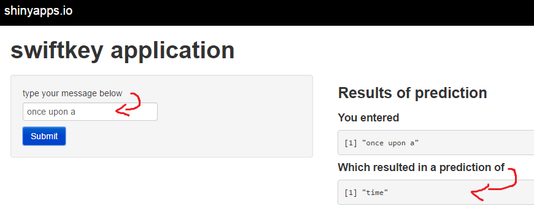

## Objective of App and Slide Deck

A Shiny app that takes as input a phrase (multiple words) in a text box input and outputs a prediction of the next word.

This slide deck consisting of no more than 5 slides created with R Studio Presenter wil pitch my algorithm and app.

### What was given:
1. over 700k english text from twitters, blogs and news each.

--- .class #id 

## Steps done in Pre-processing:

1. transform the words to lower case
2. remove numbers
3. remove punctuation
4. stem document
5. compute the various n-grams (created to 4grams)
6. remove low frequency n-grams for optimal performance such that it can be placed online

--- .class #id

## Model Algorithm

Adopted the model algorithm from Kat's backoff model.

Summary:

1. model will search for the higher n-gram
2. if not available, search for the next lower n-gram

For more detail:
http://en.wikipedia.org/wiki/Katz%27s_back-off_model

--- .class #id

## Link

The link to the application
https://weibin-kelvin.shinyapps.io/swiftkey10/

--- .class #id
## THANK YOU!
